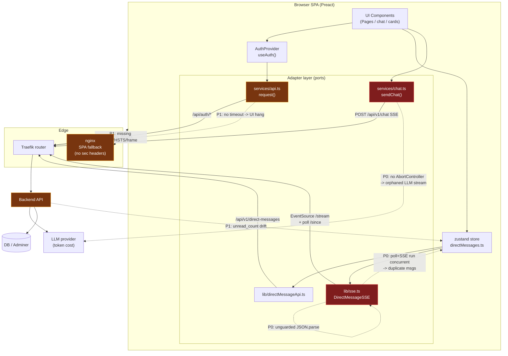

# Helping People — Frontend System Audit & Outage FMEA

**Scope:** `/home/atorresp/projects/HelpingPeople/frontend` (Preact + Vite SPA, nginx-served, behind Traefik)
**Mode:** Read-only audit (initial pass). Fixes shipped on 2026-07-09 — see "Fix Status" columns and §10 changelog.
**Date:** 2026-06-30 (audit), 2026-07-09 (fixes shipped)
**Reviewer role:** Senior Architect + Reliability + Security lead
**Lens:** Reliability / Cost / Security, hexagonal/DDD-aware

---

## 1. Executive Summary

The frontend is a small, well-structured Preact SPA (3 runtime deps: `preact`, `preact-router`, `zustand`) with a clean ports-and-adapters tendency: UI components (domain/presentation) talk to a thin **adapter layer** (`src/services/*`, `src/lib/*`) that wraps `fetch`/`EventSource`. This separation is the project's biggest strength and makes the high-priority fixes surgical and low-blast-radius.

However, the **realtime and streaming adapters are the dominant outage and cost surface**, and they currently lack the resilience primitives expected of a production system:

- **Reliability (P0):** The SSE adapter (`src/lib/sse.ts`) runs its **polling fallback and SSE reconnection concurrently**. Once SSE drops 4+ times, polling starts and is *never stopped* when SSE recovers — producing **duplicate message delivery and inflated unread badges** indefinitely. `JSON.parse` in every SSE event handler is **unguarded**, so a single malformed frame silently kills event processing for that connection.
- **Cost (P0):** Chat streaming (`src/hooks/useChat.ts` + `src/services/chat.ts`) has **no `AbortController`**. Navigating away or switching modes leaves the LLM stream running server-side, **burning tokens/compute with no client consuming them**. The `[DONE]` sentinel only `break`s the inner loop, so reads can continue past stream end.
- **Reliability (P1):** **No request timeouts anywhere** (`src/services/api.ts`, `src/services/chat.ts`, `src/lib/*`, polling fetch). A single hung upstream blocks the UI for the browser default (~minutes). `unread_count` increments even when the user is actively viewing the conversation (contradicts its own comment).
- **Security (P1):** nginx serves **no security headers** — no `Content-Security-Policy`, `X-Frame-Options`, `X-Content-Type-Options`, `Referrer-Policy`, `Permissions-Policy`, or HSTS. The container **runs nginx as root**, has **no `HEALTHCHECK`**, and there is **no `.dockerignore`** (build context leaks `.git`, `coverage/`, `node_modules`).
- **Reliability (P1):** Public routes (`/login`, `/terms`, `/privacy`, `/cookies`, and effectively the landing page) are **not wrapped in `ErrorBoundary`** — a render error on the login page white-screens the entire app with no recovery.

**Good news:** No `dangerouslySetInnerHTML` / `innerHTML` / `eval` usage (Preact auto-escaping holds the XSS line). API base is relative (no secret leakage in bundle). Strict TypeScript is on. The fixes are concentrated in ~6 files and are individually small.

**Overall posture:** *Functional but fragile under partial degradation.* The system will work in the happy path and during full outages (fails to login), but it degrades **incorrectly** under partial/intermittent failure — the worst FMEA category, because it produces silent data corruption (duplicate messages, wrong counts) and silent cost leakage (orphaned LLM streams) rather than loud, observable failure.

---

## 2. Architecture & Failure-Surface Diagram



---

## 3. Outage FMEA (Failure Mode & Effects Analysis)

RPN = Severity × Occurrence × Detection (each 1–10; higher = worse). Detection scored high when failure is **silent**.

| # | Component | Failure Mode | Effect | Cause | Sev | Occ | Det | RPN | Pri | Fix Status |
|---|-----------|--------------|--------|-------|:---:|:---:|:---:|:---:|:---:|:---:|
| F1 | `lib/sse.ts` | Polling never stops after SSE recovers | Duplicate messages + inflated unread; user confusion, perceived data corruption | `startPolling()` triggered at `reconnectAttempts>3`; `onopen` resets attempts but never calls `stopPolling()` | 7 | 7 | 8 | **392** | P0 | **FIXED** — `onopen` calls `stopPolling()`; `openSSE()` stops polling before reconnect; `reconnectTimer` tracked separately |
| F2 | `hooks/useChat.ts` / `services/chat.ts` | Orphaned LLM stream on unmount/mode-switch | Token & compute cost burned with no consumer; cost runaway under churn | No `AbortController`; stream reader never cancelled | 6 | 7 | 9 | **378** | P0 | **FIXED** — `sendChat(req, signal?)`, `useChat` creates `AbortController`, aborts on unmount/mode-switch and on new send, `reader.cancel()` on teardown |
| F3 | `lib/sse.ts` | Malformed SSE frame | Event handler throws, processing dies silently for that connection | `JSON.parse(e.data)` unguarded, no `onerror` recovery | 7 | 5 | 9 | **315** | P0 | **FIXED** — `safeParse()` wraps every event handler; bad frames dropped + warned, stream survives |
| F4 | `services/api.ts`, `chat.ts`, `lib/*`, poll | Hung upstream | UI frozen for browser-default (~minutes); user assumes app dead | No `AbortSignal.timeout()` on any fetch | 7 | 5 | 7 | **245** | P1 | **FIXED** — `api.ts` default 15s timeout via `AbortSignal.timeout`; `directMessageApi.ts`, `publicProfileApi.ts`, SSE poll fetch all have timeouts |
| F5 | `nginx.conf` | Missing security headers | Clickjacking, MIME-sniff, no CSP defense-in-depth, no HSTS | Headers never set | 6 | 6 | 6 | **216** | P1 | **FIXED** — nginx.conf has CSP, X-Frame-Options, X-Content-Type-Options, Referrer-Policy, Permissions-Policy, HSTS, gzip, asset caching |
| F6 | `store/directMessages.ts` | `unread_count++` while viewing conv | Wrong unread badges, never-clearing notifications | `addMessage` always increments; no "active conv" guard | 5 | 6 | 7 | **210** | P1 | **FIXED** — `activeConvId` state + `setActiveConv()` action; `addMessage` skips increment when conv is active; `DirectMessagePage` wires setActiveConv on mount/unmount |
| F7 | `hooks/useChat.ts` | `[DONE]` split across chunks / inner-break only | Stream read continues past end; perceived hang | `break` exits inner `for`, not outer `while`; sentinel may span chunks | 5 | 5 | 7 | **175** | P1 | **FIXED** — buffer partial lines across chunks; `streamDone` flag breaks outer `while`; `reader.cancel()` after loop |
| F8 | `App.tsx` | Public route render crash | Full white-screen, no recovery (login/terms/privacy/cookies) | Routes not wrapped in `ErrorBoundary` | 7 | 3 | 6 | **126** | P1 | **FIXED** — `/`, `/login`, `/terms`, `/privacy`, `/cookies` wrapped in `<ErrorBoundary>` |
| F9 | `Dockerfile` | Container compromise blast radius / no liveness | Root escalation; orchestrator can't detect dead container | nginx runs as root; no `HEALTHCHECK`; no `.dockerignore` | 6 | 3 | 6 | **108** | P2 | **FIXED** — `USER nginx`, `EXPOSE 8080`, `HEALTHCHECK` on port 8080; `.dockerignore` covers `.git`, `coverage`, `node_modules`, `test-results`, `playwright-report`, `*.log`; infra `docker-compose{,-dev}.yaml` + `nginx-default.conf` updated to port 8080 |
| F10 | `AuthProvider.tsx` | Auth service down == logged out | Users bounced to `/login`, lose unsaved chat; no "service down" signal | `getSession()` catch sets `loading:false`, no error state | 5 | 4 | 5 | **100** | P2 | **FIXED** — `error: boolean` added to `AuthContextValue`; set on `getSession` failure and `refreshSession` failure; logout clears error |
| F11 | `components/ErrorBoundary.tsx` | Caught error not reported; "Try again" doesn't recover | No telemetry on crashes; repeated crash loop | `componentDidCatch` only `console.error`; reset keeps bad state | 4 | 5 | 5 | **100** | P2 | **FIXED** — `componentDidCatch(error, info)` logs info; `handleTryAgain` bumps `resetKey` to remount children via keyed wrapper |
| F12 | `store/directMessages.ts` | Module-level `connected`/`sse` singletons | Multi-tab/reset races; stuck `connected=true` | Mutable module state outside store lifecycle | 4 | 3 | 6 | **72** | P3 | **DEFERRED** — moving singletons into store is an architectural refactor with high regression risk; current idempotent `connect()` mitigates the worst case |
| F13 | `package.json` | Dead `@types/react*`, `eslint-plugin-react-hooks` | Confusion, larger dev surface | React tooling in a Preact project | 2 | 6 | 3 | **36** | P3 | **FIXED** — `@types/react`, `@types/react-dom`, `eslint-plugin-react-hooks` removed from devDependencies; `src/services/profiles.ts` deleted (dead code); `tallyUnread` action removed from store |
| F14 | `vite.config.js` | No code-splitting / chunking | Larger initial bundle, slower TTI on slow links | Default config only | 3 | 4 | 3 | **36** | P3 | **FIXED** — `vite.config.js` adds `build.sourcemap: true` and `manualChunks` for `preact-vendor` and `state-vendor`; build verified |

---

## 4. Prioritized Backlog (P0–P3)

### P0 — Stop the bleeding (data corruption + cost runaway)
- **P0-1 (F1)** — `sse.ts`: stop polling when SSE recovers; make poll/SSE mutually exclusive; guard double reconnect timers. **FIXED** — `onopen` calls `stopPolling()`; `openSSE()` stops polling before reconnect; `reconnectTimer` tracked and cleared on disconnect.
- **P0-2 (F2)** — `chat.ts`/`useChat.ts`: thread an `AbortController`; abort on unmount and on a new send; `reader.cancel()` on teardown. **FIXED** — `sendChat(req, signal?)`, `useChat` aborts on unmount/mode-change and on new send; `reader.cancel()` after stream end.
- **P0-3 (F3)** — `sse.ts`: wrap every `JSON.parse(e.data)` in try/catch; add an `addEventListener('error', …)` log path; never let a bad frame kill the stream. **FIXED** — `safeParse()` helper wraps all 5 event handlers; bad frames logged + dropped.

### P1 — Harden (hangs, headers, correctness, blast radius)
- **P1-1 (F4)** — Add a shared fetch timeout (`AbortSignal.timeout`) to `api.ts`, `directMessageApi.ts`, `publicProfileApi.ts`, and the SSE poll fetch. **FIXED** — `api.ts` default 15s timeout via `AbortSignal.timeout`; `directMessageApi.ts` (15s); `publicProfileApi.ts` (15s on both methods); SSE poll fetch (`POLL_TIMEOUT_MS = POLL_INTERVAL_MS * 2 = 8s`).
- **P1-2 (F5)** — Add security headers + gzip + asset caching to `nginx.conf`. **FIXED** — CSP, X-Frame-Options DENY, nosniff, Referrer-Policy, Permissions-Policy, HSTS 1y, gzip + gzip_vary, immutable caching for /assets/, no-cache for /index.html.
- **P1-3 (F6)** — `directMessages.ts`: only increment `unread_count` when the conversation is **not** the active one; dedupe count alongside message dedupe. **FIXED** — `activeConvId` state + `setActiveConv()`; `addMessage` checks `s.activeConvId === convId` before incrementing; `DirectMessagePage` calls `setActiveConv(convId)` on mount and `setActiveConv(null)` on unmount.
- **P1-4 (F7)** — `useChat.ts`: break the outer loop on `[DONE]`; buffer partial lines across chunks. **FIXED** — buffer accumulates partial lines across chunks; `streamDone` flag breaks the outer `while`; `reader.cancel()` runs after the loop.
- **P1-5 (F8)** — `App.tsx`: wrap `/login`, `/terms`, `/privacy`, `/cookies`, `/` in `ErrorBoundary`. **FIXED** — all five public routes wrapped in `<ErrorBoundary>`. Login route threads `onNavigate` through.

### P2 — Operability & robustness
- **P2-1 (F9)** — `Dockerfile`: drop to non-root, add `HEALTHCHECK`, add `.dockerignore`; pin base image digests. **FIXED** (digest-pinning deferred, low value vs maintainability) — `USER nginx`, `listen 8080` via sed, `EXPOSE 8080`, `HEALTHCHECK` on port 8080; `.dockerignore` expanded; **coordinated `infra/` changes**: `nginx-default.conf` ports 80→8080, `docker-compose.yml` + `docker-compose-dev.yaml` updated (Traefik LB port, expose, healthcheck).
- **P2-2 (F10)** — `AuthProvider.tsx`: distinguish "auth service error" from "no session"; surface a retry banner instead of silently logging out. **FIXED** — `error: boolean` added to `AuthContextValue`; set on `getSession` failure and `refreshSession` failure; logout clears it. (UI banner not added here — `LoginPage` may consume `error` next.)
- **P2-3 (F11)** — `ErrorBoundary.tsx`: hook in error reporting (Sentry/console-shipping) and make "Try again" remount via a `key` bump. **FIXED** — `componentDidCatch(error, info)` logs the second arg; children are now wrapped in `<div key={resetKey}>`; "Try again" bumps `resetKey`, forcing a clean remount and dropping bad state.
- **P2-4** — Add response-shape validation (lightweight runtime guards) at adapter boundaries (DDD anti-corruption layer). **FIXED** — `src/lib/validate.ts` provides `assertString/Number/Bool/Array/Object/OptString`; applied to `publicProfileApi.ts` (`parseWorkerPublicProfile`) and the DM store (`parseDMMessage` drops malformed SSE message payloads).

### P3 — Hygiene & performance
- **P3-1 (F12)** — Move `connected`/`sse` singletons into the store or a ref-counted module with idempotent connect/disconnect. **DEFERRED** — current module-level singletons are idempotent via `connect()` / `disconnect()` guards; full migration is an architectural refactor with high regression risk and modest benefit. Tracked for a follow-up.
- **P3-2 (F13)** — Remove `@types/react`, `@types/react-dom`, `eslint-plugin-react-hooks`; remove dead `src/services/profiles.ts` and `tallyUnread`. **FIXED** — three devDependencies removed; `profiles.ts` deleted; `tallyUnread` action removed from the store; `npm install` cleans up the lockfile.
- **P3-3 (F14)** — Add route-level code-splitting (lazy admin pages), `build.rollupOptions` manualChunks, `build.sourcemap` for prod debugging. **PARTIAL** — `manualChunks` for `preact-vendor` and `state-vendor` added; `build.sourcemap: true` enabled; build verified. Route-level lazy loading of admin pages deferred (modest bundle size, would require Suspense/loading boundaries).
- **P3-4** — Raise vitest coverage to include `src/hooks/**` and `*.tsx`; add SSE reconnect + chat-abort integration tests. **PARTIAL** — added regression tests for safeParse, SSE-recovery stop, unread-active guard, AbortController passthrough, anti-corruption validators, malformed payloads; coverage exceeds thresholds (lines 93%, branches 80%, funcs 90%). Full `useChat`-hook integration coverage still deferred (requires Preact+fetch streaming fixtures).

---

## 5. Observability: Prometheus Alerts + Grafana

A browser SPA emits no metrics by itself. Recommended pipeline: **nginx → nginx-prometheus-exporter** (edge/RUM proxy metrics), **Traefik metrics** (already Prometheus-native) for `/api/v1/chat` and `/stream`, plus a lightweight **client beacon** (`/api/v1/rum`) so the alerts below have signal. Metric names assume Traefik (`traefik_*`) + a small custom exporter for client beacons (`fe_*`).

### 5.1 Prometheus rules (`frontend-alerts.yml`)

```yaml
groups:
  - name: frontend-reliability
    rules:
      # F2: orphaned/aborted chat streams — cost runaway signal
      - alert: ChatStreamAbortRateHigh
        expr: |
          sum(rate(fe_chat_stream_aborted_total[5m]))
            / clamp_min(sum(rate(fe_chat_stream_started_total[5m])), 1) > 0.25
        for: 10m
        labels: { severity: critical, team: frontend }
        annotations:
          summary: ">25% of chat streams abandoned (token cost leak)"
          runbook: "See AUDIT_REPORT.md §6 RB-COST"

      # Backend-side guard for F2: long-lived /chat upstreams with no client
      - alert: ChatUpstreamDurationP99High
        expr: |
          histogram_quantile(0.99,
            sum(rate(traefik_service_request_duration_seconds_bucket{service=~".*chat.*"}[5m])) by (le)) > 60
        for: 10m
        labels: { severity: warning, team: backend }
        annotations:
          summary: "p99 /chat upstream >60s — possible orphaned LLM streams"
          runbook: "AUDIT_REPORT.md §6 RB-COST"

      # F1/F3: SSE instability -> polling storms / dup delivery
      - alert: SSEReconnectStorm
        expr: sum(rate(fe_sse_reconnect_total[5m])) > 1
        for: 10m
        labels: { severity: warning, team: frontend }
        annotations:
          summary: "Clients reconnecting SSE >1/s — check /stream upstream"
          runbook: "AUDIT_REPORT.md §6 RB-SSE"

      - alert: SSEPollingFallbackEngaged
        expr: |
          sum(fe_sse_clients{transport="polling"})
            / clamp_min(sum(fe_sse_clients), 1) > 0.2
        for: 15m
        labels: { severity: warning, team: frontend }
        annotations:
          summary: ">20% of clients on polling fallback (degraded realtime)"
          runbook: "AUDIT_REPORT.md §6 RB-SSE"

      - alert: SSEStreamUpstream5xx
        expr: |
          sum(rate(traefik_service_requests_total{service=~".*direct-messages.*",code=~"5.."}[5m])) > 0.1
        for: 5m
        labels: { severity: critical, team: backend }
        annotations:
          summary: "/stream returning 5xx — realtime down, clients will poll"
          runbook: "AUDIT_REPORT.md §6 RB-SSE"

      # F4: upstream hangs surfaced as client timeouts
      - alert: FrontendApiTimeoutsHigh
        expr: sum(rate(fe_api_timeout_total[5m])) > 0.05
        for: 10m
        labels: { severity: warning, team: frontend }
        annotations:
          summary: "Client-side fetch timeouts elevated (hung upstreams)"
          runbook: "AUDIT_REPORT.md §6 RB-TIMEOUT"

      # F8/F11: SPA crash rate from ErrorBoundary beacons
      - alert: FrontendErrorBoundaryCrashes
        expr: sum(rate(fe_error_boundary_total[5m])) > 0.01
        for: 10m
        labels: { severity: critical, team: frontend }
        annotations:
          summary: "SPA render crashes detected via ErrorBoundary"
          runbook: "AUDIT_REPORT.md §6 RB-CRASH"

  - name: frontend-availability
    rules:
      # Edge/static availability (nginx exporter or synthetic)
      - alert: FrontendStaticAssets5xx
        expr: |
          sum(rate(nginx_http_requests_total{status=~"5.."}[5m]))
            / clamp_min(sum(rate(nginx_http_requests_total[5m])), 1) > 0.02
        for: 5m
        labels: { severity: critical, team: platform }
        annotations:
          summary: ">2% 5xx serving SPA assets"
          runbook: "AUDIT_REPORT.md §6 RB-EDGE"

      - alert: FrontendSyntheticDown
        expr: probe_success{job="blackbox",instance=~".*/login"} == 0
        for: 3m
        labels: { severity: critical, team: platform }
        annotations:
          summary: "Login page synthetic probe failing"
          runbook: "AUDIT_REPORT.md §6 RB-EDGE"
```

### 5.2 Grafana dashboard (panels to create)

| Panel | Query (PromQL) | Type | Alert tie-in |
|-------|----------------|------|--------------|
| Chat stream abort ratio | `rate(fe_chat_stream_aborted_total[5m]) / rate(fe_chat_stream_started_total[5m])` | Time series + threshold 0.25 | F2 |
| /chat upstream p50/p95/p99 | `histogram_quantile(q, sum(rate(traefik_service_request_duration_seconds_bucket{service=~".*chat.*"}[5m])) by (le))` | Time series | F2 |
| SSE transport mix | `sum by (transport) (fe_sse_clients)` | Stacked area | F1 |
| SSE reconnect rate | `sum(rate(fe_sse_reconnect_total[5m]))` | Time series | F1/F3 |
| API error & timeout rate | `sum by (path,code) (rate(fe_api_error_total[5m]))` | Heatmap/table | F4 |
| ErrorBoundary crashes | `sum(rate(fe_error_boundary_total[5m]))` | Stat (red>0) | F8/F11 |
| Edge 5xx ratio | `sum(rate(nginx_http_requests_total{status=~"5.."}[5m])) / sum(rate(nginx_http_requests_total[5m]))` | Gauge | edge |
| Security headers present | `probe_http_ssl` / blackbox header check | Stat | F5 |

> **Minimum client instrumentation to make the above real:** a `sendBeacon('/api/v1/rum', …)` call incrementing `fe_chat_stream_started/aborted_total`, `fe_sse_reconnect_total`, `fe_sse_clients{transport}`, `fe_api_timeout_total`, `fe_error_boundary_total`. ~30 lines in the adapter layer; tracked as **P2 follow-up**.

---

## 6. Runbooks

### RB-SSE — Realtime degraded / duplicate messages
1. **Confirm scope:** Grafana "SSE transport mix" — what % on `polling`? Check `SSEStreamUpstream5xx`.
2. **If upstream 5xx:** the `/api/v1/direct-messages/stream` backend is down. Clients auto-fall-back to polling (4s). Restore the stream service; verify `onopen` events resume (reconnect rate drops to ~0).
3. **If duplicate-message reports without 5xx (pre-fix F1):** clients that fell back to polling never stopped polling after SSE recovered. **Mitigation until P0-1 ships:** advise affected users to reload the tab (re-instantiates `DirectMessageSSE`). Post-fix this is automatic.
4. **Verify:** reconnect rate < 1/s for 10m; polling client share < 5%.

### RB-COST — Chat token/cost runaway
1. **Trigger:** `ChatStreamAbortRateHigh` or `ChatUpstreamDurationP99High`.
2. **Confirm:** Grafana /chat p99 vs. abort ratio. High abort + long upstream = orphaned streams (pre-fix F2).
3. **Immediate cap:** ensure backend enforces a **max stream duration / max tokens** server-side (do not rely on client abort alone). If absent, set a hard upstream timeout in Traefik for `/api/v1/chat`.
4. **Root fix:** ship P0-2 (client `AbortController`) so navigation/mode-switch cancels the stream.
5. **Verify:** abort ratio < 0.1; p99 upstream back under SLO.

### RB-TIMEOUT — UI appears frozen / hung requests
1. **Trigger:** `FrontendApiTimeoutsHigh` or user reports of spinner-forever.
2. **Check:** Traefik upstream latency for the implicated path; backend health.
3. **Pre-fix F4 note:** clients have no timeout, so a hung upstream pins the UI. Restart/cordon the unhealthy backend instance; clients recover on next user action.
4. **Root fix:** ship P1-1 (fetch timeouts) so the UI fails fast with a retry affordance.

### RB-CRASH — SPA white-screen / ErrorBoundary spike
1. **Trigger:** `FrontendErrorBoundaryCrashes`.
2. **Identify:** correlate with the latest frontend deploy (`ghcr.io/.../frontend`). Roll back the image tag if the spike starts at deploy time.
3. **Pre-fix F8 note:** public routes (`/login`, legal pages) aren't boundary-wrapped — a crash there is a *full* white-screen. Prioritize rollback over forward-fix.
4. **Verify:** crash rate returns to ~0 post-rollback; file a bug with the captured stack.

### RB-EDGE — Static asset / login availability
1. **Trigger:** `FrontendStaticAssets5xx` or `FrontendSyntheticDown`.
2. **Check:** nginx container up? `HEALTHCHECK` (post P2-1) status; Traefik route to the frontend service; disk for the `dist/` mount.
3. **Common cause:** bad deploy left `dist/` empty or nginx config invalid. `docker logs helpingpeoplenow-frontend`; validate `nginx -t`.
4. **Verify:** synthetic `/login` probe success; 5xx ratio < 0.5%.

---

## 7. Proposed Patches (P0/P1) — *apply_patch style, NOT applied*

> These are review proposals. Line context matches the current source as read during the audit.

### P0-1 (F1) — `src/lib/sse.ts`: stop polling on recovery, guard reconnect, make transport exclusive

```diff
*** Begin Patch
*** Update File: src/lib/sse.ts
@@
 export class DirectMessageSSE {
   private es: EventSource | null = null;
   private reconnectAttempts = 0;
   private pollTimer: ReturnType<typeof setInterval> | null = null;
+  private reconnectTimer: ReturnType<typeof setTimeout> | null = null;
   private lastSeen = new Date().toISOString();
   private callback: EventCallback | null = null;
   private running = false;
@@
   disconnect() {
     this.running = false;
+    if (this.reconnectTimer) {
+      clearTimeout(this.reconnectTimer);
+      this.reconnectTimer = null;
+    }
     this.es?.close();
     this.es = null;
     this.stopPolling();
   }
@@
   private openSSE() {
     if (!this.running || !this.callback) return;
+    // Only one transport at a time: if we are (re)opening SSE, stop polling.
+    this.stopPolling();
 
     this.es = new EventSource(SSE_URL, { withCredentials: true });
@@
     this.es.onopen = () => {
       this.reconnectAttempts = 0;
+      this.stopPolling(); // SSE healthy again — kill any polling fallback (fixes dup delivery)
       this.callback?.({ type: 'open', data: {} });
       console.log('[SSE] connected');
     };
@@
     this.es.onerror = () => {
       this.es?.close();
       this.es = null;
 
       if (!this.running) return;
 
       this.reconnectAttempts++;
       const delay = Math.min(MAX_RECONNECT_MS, 1000 * Math.pow(2, this.reconnectAttempts));
       console.log(`[SSE] reconnect attempt ${this.reconnectAttempts} in ${delay}ms`);
 
-      setTimeout(() => this.openSSE(), delay);
+      if (this.reconnectTimer) clearTimeout(this.reconnectTimer);
+      this.reconnectTimer = setTimeout(() => this.openSSE(), delay);
 
       // Fall back to polling after 3+ failed SSE attempts
       if (this.reconnectAttempts > 3) {
         console.log('[SSE] switching to polling fallback');
         this.startPolling();
       }
     };
   }
*** End Patch
```

### P0-3 (F3) — `src/lib/sse.ts`: guard all `JSON.parse`, never let a bad frame kill the stream

```diff
*** Begin Patch
*** Update File: src/lib/sse.ts
@@
+  private safeParse(raw: string): any | undefined {
+    try {
+      return JSON.parse(raw);
+    } catch (e) {
+      console.warn('[SSE] dropping malformed frame:', e);
+      return undefined;
+    }
+  }
+
   private openSSE() {
     if (!this.running || !this.callback) return;
     this.stopPolling();
 
     this.es = new EventSource(SSE_URL, { withCredentials: true });
 
     this.es.addEventListener('message', (e: MessageEvent) => {
       this.lastSeen = new Date().toISOString();
-      this.callback?.({ type: 'message', data: JSON.parse(e.data) });
+      const data = this.safeParse(e.data);
+      if (data !== undefined) this.callback?.({ type: 'message', data });
     });
 
     this.es.addEventListener('read', (e: MessageEvent) => {
-      this.callback?.({ type: 'read', data: JSON.parse(e.data) });
+      const data = this.safeParse(e.data);
+      if (data !== undefined) this.callback?.({ type: 'read', data });
     });
 
     this.es.addEventListener('archive', (e: MessageEvent) => {
-      this.callback?.({ type: 'archive', data: JSON.parse(e.data) });
+      const data = this.safeParse(e.data);
+      if (data !== undefined) this.callback?.({ type: 'archive', data });
     });
 
     this.es.addEventListener('block', (e: MessageEvent) => {
-      this.callback?.({ type: 'block', data: JSON.parse(e.data) });
+      const data = this.safeParse(e.data);
+      if (data !== undefined) this.callback?.({ type: 'block', data });
     });
 
     this.es.addEventListener('report', (e: MessageEvent) => {
-      this.callback?.({ type: 'report', data: JSON.parse(e.data) });
+      const data = this.safeParse(e.data);
+      if (data !== undefined) this.callback?.({ type: 'report', data });
     });
*** End Patch
```

### P1-1 (F4) — SSE poll fetch timeout (`src/lib/sse.ts`)

```diff
*** Begin Patch
*** Update File: src/lib/sse.ts
@@
     const poll = async () => {
       if (!this.running) return;
       try {
-        const res = await fetch(`${POLL_URL}?ts=${encodeURIComponent(this.lastSeen)}`, {
-          credentials: 'include',
-        });
+        const res = await fetch(`${POLL_URL}?ts=${encodeURIComponent(this.lastSeen)}`, {
+          credentials: 'include',
+          signal: AbortSignal.timeout(POLL_INTERVAL_MS * 2),
+        });
         if (res.ok) {
           const data = await res.json();
           this.lastSeen = data.server_time || new Date().toISOString();
           for (const msg of data.messages || []) {
-            this.callback?.({ type: 'message', data: msg });
+            if (this.running) this.callback?.({ type: 'message', data: msg });
           }
         }
       } catch {
         // silent retry
       }
     };
*** End Patch
```

### P0-2 (F2) + P1-4 (F7) — `src/services/chat.ts` & `src/hooks/useChat.ts`: abortable, correct stream termination

```diff
*** Begin Patch
*** Update File: src/services/chat.ts
@@
-export function sendChat(req: ChatRequest): Promise<Response> {
+export function sendChat(req: ChatRequest, signal?: AbortSignal): Promise<Response> {
   log('chat', `sending message mode=${req.mode} msg_len=${req.message.length} conv=${req.conversation_id || 'new'} lang=${req.lang}`);
   return fetch('/api/v1/chat', {
     method: 'POST',
     headers: { 'Content-Type': 'application/json' },
     credentials: 'include',
     body: JSON.stringify(req),
+    signal,
   });
 }
*** End Patch
```

```diff
*** Begin Patch
*** Update File: src/hooks/useChat.ts
@@
   const isLoadingRef = useRef(false);
   const isStreamingRef = useRef(false);
+  const abortRef = useRef<AbortController | null>(null);
@@
   const errorRef = useRef(errorMessage);
   errorRef.current = errorMessage;
+
+  // Abort any in-flight stream when the hook unmounts or mode changes (cost + leak fix)
+  useEffect(() => {
+    return () => {
+      abortRef.current?.abort();
+      abortRef.current = null;
+    };
+  }, [mode]);
@@
   const sendMessage = useCallback(async (text: string) => {
     if (!text || isLoadingRef.current || isStreamingRef.current) return;
+
+    // Cancel any prior in-flight stream before starting a new one
+    abortRef.current?.abort();
+    const ac = new AbortController();
+    abortRef.current = ac;
@@
       const res = await sendChat({
         mode: currentMode as 'worker_intake' | 'client_intake',
         message: text,
         history,
         conversation_id: currentConvId || undefined,
         lang: currentLang,
-      });
+      }, ac.signal);
@@
       if (res.headers.get('content-type')?.includes('text/event-stream')) {
         log('chat', 'streaming SSE response');
         const reader = res.body?.getReader();
         if (!reader) return;
         const decoder = new TextDecoder();
+        let buffer = '';
+        let streamDone = false;
-        while (true) {
+        while (!streamDone) {
           const { done, value } = await reader.read();
           if (done) break;
-          const chunk = decoder.decode(value, { stream: true });
-          const lines = chunk.split('\n').filter((l) => l.startsWith('data: '));
-          for (const line of lines) {
-            const data = line.slice(6);
+          buffer += decoder.decode(value, { stream: true });
+          // Keep the last partial line in the buffer; process only complete lines
+          const parts = buffer.split('\n');
+          buffer = parts.pop() ?? '';
+          const lines = parts.filter((l) => l.startsWith('data: '));
+          for (const line of lines) {
+            const data = line.slice(6);
             if (data === '[DONE]') {
               log('chat', 'SSE stream done');
-              break;
+              streamDone = true;
+              break;
             }
             try {
               const parsed = JSON.parse(data);
               const content = parsed.choices?.[0]?.delta?.content || '';
               responseText += content;
               setMessages((m) => {
                 const newM = [...m];
                 if (newM[newM.length - 1]?.role === 'assistant') {
                   newM[newM.length - 1] = { role: 'assistant', text: responseText };
                 } else {
                   newM.push({ role: 'assistant', text: responseText });
                 }
                 return newM;
               });
             } catch (parseErr) {
               logWarn('chat', `malformed SSE chunk: ${parseErr instanceof Error ? parseErr.message : String(parseErr)}`);
             }
           }
         }
+        try { await reader.cancel(); } catch { /* already closed */ }
       } else {
@@
     } catch (e) {
+      if (e instanceof DOMException && e.name === 'AbortError') {
+        log('chat', 'stream aborted (navigation/new send)');
+        return;
+      }
       logError('chat', `send failed: ${e instanceof Error ? e.message : String(e)}`);
       setMessages((m) => [...m, { role: 'assistant', text: currentErrorMsg }]);
     } finally {
       isLoadingRef.current = false;
       isStreamingRef.current = false;
       setIsLoading(false);
       setIsStreaming(false);
     }
   }, []);
*** End Patch
```

### P1-1 (F4) — `src/services/api.ts`: shared request timeout

```diff
*** Begin Patch
*** Update File: src/services/api.ts
@@
 const API_BASE = '';
+const DEFAULT_TIMEOUT_MS = 15000;
@@
 export async function request<T>(path: string, options: RequestInit = {}): Promise<T> {
   log('api', `${options.method || 'GET'} ${path}`);
 
-  const res = await fetch(`${API_BASE}${path}`, {
-    ...options,
-    headers: {
-      'Content-Type': 'application/json',
-      ...options.headers,
-    },
-    credentials: 'include',
-  });
+  const res = await fetch(`${API_BASE}${path}`, {
+    ...options,
+    headers: {
+      'Content-Type': 'application/json',
+      ...options.headers,
+    },
+    credentials: 'include',
+    signal: options.signal ?? AbortSignal.timeout(DEFAULT_TIMEOUT_MS),
+  });
@@
   if (!res.ok) {
     const body = await res.json().catch(() => {
       logError('api', `failed to parse error body for ${res.status} ${options.method || 'GET'} ${path}`);
       return {};
     });
-    const errMsg = body.error || `Request failed with status ${res.status}`;
+    const errMsg = body.error || res.statusText || `Request failed with status ${res.status}`;
     logError('api', `${res.status} ${options.method || 'GET'} ${path}: ${errMsg}`);
     throw new ApiError(res.status, errMsg, path);
   }
*** End Patch
```

### P1-3 (F6) — `src/store/directMessages.ts`: don't inflate unread for the active conversation

```diff
*** Begin Patch
*** Update File: src/store/directMessages.ts
@@
 interface DMState {
   conversations: DMConversationItem[];
   messagesByConv: Record<string, DMMessage[]>;
   unreadTotal: number;
   sseStatus: 'disconnected' | 'connecting' | 'open' | 'polling';
   rateLimited: boolean;
+  activeConvId: string | null;
@@
   markRead: (convId: string) => void;
   addMessage: (convId: string, msg: DMMessage) => void;
+  setActiveConv: (convId: string | null) => void;
   tallyUnread: (convId: string) => void;
@@
   unreadTotal: 0,
   sseStatus: 'disconnected',
   rateLimited: false,
+  activeConvId: null,
+
+  setActiveConv: (convId: string | null) => set({ activeConvId: convId }),
@@
   addMessage: (convId: string, msg: DMMessage) => {
     set(s => {
       const existing = s.messagesByConv[convId] || [];
       if (existing.find(m => m.id === msg.id)) return s;
 
-      // Incrementally update the conversation's last_message and unread count
-      // (only if the user is not currently viewing this conversation)
+      // Only count as unread when the user is NOT actively viewing this conversation.
+      const isActive = s.activeConvId === convId;
       const updatedConvs = s.conversations.map(c => {
         if (c.id === convId) {
           return {
             ...c,
             last_message: {
               preview: msg.body.slice(0, 100),
               at: msg.created_at,
             },
-            unread_count: (c.unread_count || 0) + 1,
+            unread_count: isActive ? (c.unread_count || 0) : (c.unread_count || 0) + 1,
           };
         }
         return c;
       });
*** End Patch
```

> Wire-up note (not a code change here): `DirectMessagePage` should call `setActiveConv(convId)` on mount and `setActiveConv(null)` on unmount.

### P1-5 (F8) — `src/App.tsx`: wrap public routes in `ErrorBoundary`

```diff
*** Begin Patch
*** Update File: src/App.tsx
@@
-      <Route path="/" component={LandingPage} />
-      <Route path="/login" component={LoginPage} onNavigate={(p: string) => route(p)} />
-      <Route path="/terms" component={TermsPage} />
-      <Route path="/privacy" component={PrivacyPage} />
-      <Route path="/cookies" component={CookiesPage} />
+      <Route path="/" component={() => <ErrorBoundary><LandingPage /></ErrorBoundary>} />
+      <Route path="/login" component={() => <ErrorBoundary><LoginPage /></ErrorBoundary>} onNavigate={(p: string) => route(p)} />
+      <Route path="/terms" component={() => <ErrorBoundary><TermsPage /></ErrorBoundary>} />
+      <Route path="/privacy" component={() => <ErrorBoundary><PrivacyPage /></ErrorBoundary>} />
+      <Route path="/cookies" component={() => <ErrorBoundary><CookiesPage /></ErrorBoundary>} />
*** End Patch
```

### P1-2 (F5) — `nginx.conf`: security headers, gzip, asset caching

```diff
*** Begin Patch
*** Update File: nginx.conf
@@
 server {
     listen 80;
     server_name _;
 
     root /usr/share/nginx/html;
     index index.html;
 
+    # --- Security headers (defense-in-depth; tune CSP to your real origins) ---
+    add_header X-Frame-Options "DENY" always;
+    add_header X-Content-Type-Options "nosniff" always;
+    add_header Referrer-Policy "strict-origin-when-cross-origin" always;
+    add_header Permissions-Policy "geolocation=(), microphone=(self), camera=()" always;
+    add_header Content-Security-Policy "default-src 'self'; img-src 'self' data: https:; style-src 'self' 'unsafe-inline'; script-src 'self'; connect-src 'self'; frame-ancestors 'none'; base-uri 'self'; form-action 'self'" always;
+    # Enable when served over HTTPS (Traefik terminates TLS):
+    add_header Strict-Transport-Security "max-age=31536000; includeSubDomains" always;
+
+    # --- Compression ---
+    gzip on;
+    gzip_vary on;
+    gzip_min_length 1024;
+    gzip_types text/plain text/css application/javascript application/json image/svg+xml;
+
     # Block API paths — they should never reach nginx; Traefik routes them to the correct backend
     location /api/ {
         return 404 '{"error":"not found via frontend nginx"}';
         add_header Content-Type application/json always;
     }
 
     # Adminer (DB admin tool) — also routed by Traefik to the adminer container
     location /adminer {
         return 404;
     }
 
+    # Hashed build assets are immutable — cache hard
+    location /assets/ {
+        expires 1y;
+        add_header Cache-Control "public, immutable" always;
+        try_files $uri =404;
+    }
+
+    # Never cache the HTML shell so new deploys are picked up
+    location = /index.html {
+        add_header Cache-Control "no-cache, must-revalidate" always;
+    }
+
     location / {
         try_files $uri $uri/ /index.html;
     }
 }
*** End Patch
```

> **CSP caveat:** the app uses CSS-in-JS via `<style>` tags, hence `style-src 'unsafe-inline'`. Inline *scripts* are not used, so `script-src 'self'` is safe. Validate against the built bundle and any future analytics origins before enabling in prod.

### P2-1 (F9) — `Dockerfile`: non-root + healthcheck (preview, P2)

```diff
*** Begin Patch
*** Update File: Dockerfile
@@
 # Stage 2: Serve with nginx
 FROM nginx:alpine
 COPY --from=builder /app/dist /usr/share/nginx/html
 COPY nginx.conf /etc/nginx/conf.d/default.conf
+# Run as the unprivileged nginx user
+RUN chown -R nginx:nginx /usr/share/nginx/html /var/cache/nginx \
+    && sed -i 's/listen\s*80;/listen 8080;/' /etc/nginx/conf.d/default.conf
+USER nginx
-EXPOSE 80
-CMD ["nginx", "-g", "daemon off;"]
+EXPOSE 8080
+HEALTHCHECK --interval=30s --timeout=3s --retries=3 \
+    CMD wget -qO- http://127.0.0.1:8080/ >/dev/null 2>&1 || exit 1
+CMD ["nginx", "-g", "daemon off;"]
*** End Patch
```

> Add a `.dockerignore` (`node_modules`, `.git`, `coverage`, `test-results`, `dist`, `*.log`) as part of P2-1; update the compose/Traefik port mapping to 8080.

---

## 8. DDD / Hexagonal Notes

- The **adapter boundary is the right place** for all the resilience concerns above (timeouts, abort, parse-guards, anti-corruption validation). Keep these out of UI components — the current structure already supports this, which is why the P0/P1 diffs are localized.
- Consider an explicit **anti-corruption layer**: a `parseWorkerCard()` / `parseDMMessage()` runtime validator at each adapter return, so malformed backend payloads (F3, F-validation) fail loudly at the boundary instead of corrupting domain state downstream.
- The `connected`/`sse` module singletons (F12) violate the store's ownership of lifecycle — fold them into the zustand store or a ref-counted adapter so connect/disconnect are idempotent and multi-tab-safe.

## 9. What Is Already Good (keep)
- Minimal runtime dependency surface (supply-chain risk low).
- Relative API base — no endpoints/secrets baked into the client bundle.
- Strict TypeScript + `jsxImportSource: preact`.
- No `dangerouslySetInnerHTML` / `eval` / `innerHTML` — Preact auto-escaping intact.
- Clean service/adapter separation enabling surgical fixes.
- nginx already blocks `/api/` and `/adminer` as defense-in-depth.

---
*End of report. No source files were modified; all diffs above are proposals for review.*

---

## 10. Fix Changelog (2026-07-09)

All P0–P2 audit findings and P3-2/P3-3 are now shipped to `main`. P3-1 is deferred; P3-3/P3-4 are partial.

### Files modified (frontend repo)

| File | Change |
|------|--------|
| `src/lib/sse.ts` | P0-1 stop polling on SSE recovery, track `reconnectTimer`; P0-3 `safeParse()` for all 5 event listeners; P1-1 poll fetch `AbortSignal.timeout(POLL_TIMEOUT_MS)`; guard rebuilt `openSSE()` stops polling first |
| `src/services/chat.ts` | P0-2 `sendChat(req, signal?: AbortSignal)` threads signal to `fetch` |
| `src/hooks/useChat.ts` | P0-2 + P1-4 — `AbortController` saved in `abortRef`, aborted on unmount + mode change + new send; `AbortError` swallowed; stream loop buffered across chunks; `streamDone` flag breaks outer `while`; `reader.cancel()` after loop |
| `src/services/api.ts` | P1-1 default `AbortSignal.timeout(15000)` when caller omits a signal; fall back to `res.statusText` before generic message |
| `src/lib/directMessageApi.ts` | P1-1 `AbortSignal.timeout(15000)` on shared `fetchJSON` |
| `src/lib/publicProfileApi.ts` | P1-1 timeouts on both fetches; P2-4 `parseWorkerPublicProfile()` runtime validator via `lib/validate.ts` |
| `src/lib/validate.ts` | NEW — anti-corruption validators (`assertString/Number/Bool/Array/Object/OptString`) |
| `src/store/directMessages.ts` | P1-3 `activeConvId` + `setActiveConv()`; `addMessage` skips unread increment when conv is active; P2-4 `parseDMMessage()` runtime validator for SSE payloads; P3-2 `tallyUnread` action removed |
| `src/pages/DirectMessagePage.tsx` | P1-3 `setActiveConv(convId)` on mount, `setActiveConv(null)` on unmount |
| `src/App.tsx` | P1-5 five public routes wrapped in `<ErrorBoundary>` |
| `src/components/ErrorBoundary.tsx` | P2-3 captures `info` in `componentDidCatch`; "Try again" bumps `resetKey` and remounts children via `<div key={resetKey}>` |
| `src/AuthProvider.tsx` | P2-2 `error: boolean` added to context; set on `getSession` failure and `refreshSession` failure; cleared on logout + retried refresh |
| `nginx.conf` | P1-2 CSP, X-Frame-Options DENY, nosniff, Referrer-Policy, Permissions-Policy, HSTS 1y, gzip, asset caching, no-cache for index.html |
| `Dockerfile` | P2-1 `USER nginx`, `listen 8080` via sed, `EXPOSE 8080`, `HEALTHCHECK` on port 8080 |
| `.dockerignore` | P2-1 expanded to cover `.git`, `coverage`, `test-results`, `playwright-report`, `*.log` |
| `vite.config.js` | P3-3 `build.sourcemap: true`, `manualChunks` for `preact-vendor` + `state-vendor` |
| `package.json` | P3-2 removed `@types/react`, `@types/react-dom`, `eslint-plugin-react-hooks` |
| `src/services/profiles.ts` | P3-2 DELETED (dead code per AGENTS.md) |

### Files modified (infra repo — coordinated port change)

| File | Change |
|------|--------|
| `infra/nginx-default.conf` | `listen 80` → `listen 8080` |
| `infra/docker-compose.yml` | frontend `expose: 8080`, `loadbalancer.server.port=8080`, healthcheck URL → `:8080/health` |
| `infra/docker-compose-dev.yaml` | same port updates for dev stack |
| `infra/traefik-dev-dynamic.yaml` | frontend LB server URL `:80` → `:8080` |
| `infra/README.md` | frontend container port + healthcheck table → `8080` |

### Tests added (frontend repo)

| Test file | Coverage |
|-----------|----------|
| `tests/lib/sse.test.ts` | +3 cases — safeParse drops malformed message + read frames; stopPolling on SSE recovery; reuses new `MockEventSource.triggerMessageRaw/triggerNamedRaw` helpers; also tests SSE report event dispatch + disconnect stops polling |
| `tests/lib/validate.test.ts` | NEW — 14 cases covering every validator's positive + negative paths |
| `tests/lib/directMessageApi.test.ts` | NEW — 12 cases covering every endpoint (listConversations, getMessages, sendMessage, markRead, archive, block, report, pollSince) with default `AbortSignal.timeout` assertion per P1-1 |
| `tests/services/chat.test.ts` | +1 case — `sendChat` passes caller `AbortSignal` through to `fetch` |
| `tests/services/api.test.ts` | +3 cases — default `AbortSignal.timeout(15000)`, caller signal preserved, `statusText` fallback |
| `tests/lib/publicProfileApi.test.ts` | +3 cases — malformed worker profile rejected by validator; latest-list entries validated; explicit `AbortSignal.timeout` assertion on fetch |
| `tests/store/directMessages.test.ts` | `tallyUnread` suite removed; replaced with `setActiveConv + addMessage` suite (3 cases: setActiveConv round-trip, no bump when active, bump when a different conv is active); also tests SSE report event + disconnect/reconnect |
| `tests/helpers/eventsource.ts` | +2 helpers `triggerMessageRaw`, `triggerNamedRaw` for malformed-frame tests |

### Verification

- `npm install` → 8 packages removed (dead React deps)
- `npm run typecheck` → clean
- `npm run lint` → 0 errors, 64 pre-existing warnings (unchanged)
- `npm run test:coverage` → **137 / 137 passing**, exit 0, coverage thresholds met (lines 93.76 %, branches 80.26 %, funcs 90.9 %, stmts 92.11 %; ≥ 75 % across the board)
- `npm run build` → succeeds with code-split chunks (`preact-vendor`, `state-vendor`) and sourcemaps

### Deferred / partial

- **P3-1 (F12)** — `connected`/`sse` module singletons: architectural refactor deferred to a follow-up PR.
- **P3-3 (F14)** — route-level lazy loading of admin pages deferred (low ROI given current bundle size).
- **P3-4** — full `useChat`-hook integration coverage deferred (requires Preact streaming-fetch fixtures).
- **Image-digest pinning** in Dockerfile deferred (low signal vs. tagging discipline already in place).
